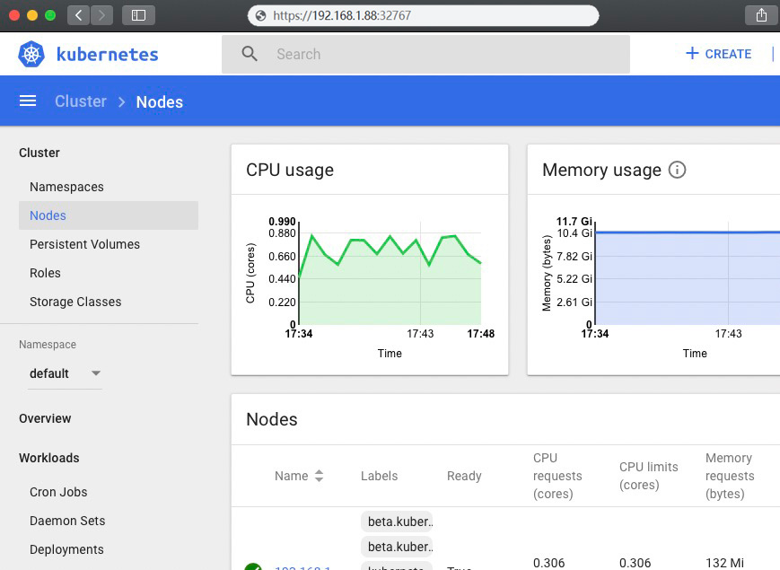

二進位方式一鍵離線安裝高可用的多kubernetes集羣，支持定時安裝、添加kubernetes節點、删除kubernetes節點、銷毀kubernetes主機、重建kubernetes主機、卸載集羣等。
<br>
（不需要在目標主機上安裝任何軟件，只需要有純淨的裸機即可離線完成高可用kubernetes集羣的部署！）

<br>


<br>

切換語言： <a href="README0.7.md">English Documents</a> | <a href="README0.7-zh-hk.md">繁体中文文档</a> | <a href="README0.7-zh.md">简体中文文档</a> | <a href="README0.7-jp.md">日本語の文書</a>

<br>

# [1] 相容性

<br>
相容性說明:

<table>
<tr><td><b>kube-install版本</b></td><td><b>支持的Kubernetes版本</b></td><td><b>支持的作業系統</b></td><td><b>相關文檔</b></td></tr>
<tr><td> kube-install v0.7.* </td><td> kubernetes v1.23, v1.22, v1.20, v1.19, v1.18, v1.17 </td><td> CentOS 7 , RHEL 7 , CentOS 8 , RHEL 8 , SUSE Linux 15 , Ubuntu 20 </td><td><a href="README0.7.md">README0.7.md</a></td></tr>
<tr><td> kube-install v0.6.* </td><td> kubernetes v1.22, v1.21, v1.20, v1.19, v1.18, v1.17, v1.16, v1.15, v1.14 </td><td> CentOS 7 , RHEL 7 , CentOS 8 , RHEL 8 , SUSE Linux 15 </td><td><a href="README0.6.md">README0.6.md</a></td></tr>
<tr><td> kube-install v0.5.* </td><td> kubernetes v1.21, v1.20, v1.19, v1.18, v1.17, v1.16, v1.15, v1.14 </td><td> CentOS 7 , RHEL 7 </td><td><a href="README0.5.md">README0.5.md</a></td></tr>
<tr><td> kube-install v0.4.* </td><td> kubernetes v1.21, v1.20, v1.19, v1.18, v1.17, v1.16, v1.15, v1.14 </td><td> CentOS 7 , RHEL 7 </td><td><a href="README0.4.md">README0.4.md</a></td></tr>
<tr><td> kube-install v0.3.* </td><td> kubernetes v1.18, v1.17, v1.16, v1.15, v1.14 </td><td>CentOS 7</td><td><a href="README0.3.md">README0.3.md</a></td></tr>
<tr><td> kube-install v0.2.* </td><td> kubernetes v1.14 </td><td> CentOS 7 </td><td><a href="README0.2.md">README0.2.md</a></td></tr>
<tr><td> kube-install v0.1.* </td><td> kubernetes v1.14 </td><td> CentOS 7 </td><td><a href="README0.1.md">README0.1.md</a></td></tr>
</table>

<br>
注意：kube-install支持CentOS 7、CentOS 8、SUSE 15、RHEL 7和RHEL 8作業系統環境，<a href=“docs/os-support.md”>點擊這裡查看kube-install所支持的作業系統發行版本的清單</a>。
<br>
<br>
<br>

# [2] 獲取kube-install套裝軟體

<br>

你可以從https://github.com/cloudnativer/kube-install/releases 這裡下載`kube-install-*.tgz`套裝軟體。<br>
舉例，下載`kube-install-allinone-v0.7.4.tgz`套裝軟體進行安裝：<br>

```
# cd /root/
# curl -O https://github.com/cloudnativer/kube-install/releases/download/v0.7.4/kube-install-allinone-v0.7.4.tgz
# tar -zxvf kube-install-allinone-v0.7.4.tgz
# cd /root/kube-install/
```

注意：如果你本地的網路環境不是太好的話，建議你使用支持中斷點續傳的下載軟體進行套裝軟體下載，這樣可以獲得更好的下載體驗。

<br>
<br>
<br>

# [3] 通過命令列快速安裝kubernetes集羣

<br>

如果你有四臺服務器，k8s-master安裝在三臺服務器（192.168.1.11、192.168.1.12、192.168.1.13）上，k8s-node安裝在四臺服務器（192.168.1.11、192.168.1.12、192.168.1.13、192.168.1.14）上。服務器的作業系統是純淨的CentOS Linux或RHEL（RedHat Enterprise Linux），具體如下表所示：
<table>
<tr><td><b>IP地址</b></td><td><b>需要安裝的組件</b></td><td><b>作業系統版本</b></td><td><b>root密碼</b></td></tr>
<tr><td>192.168.1.11</td><td>k8s-master,k8s-node,kube-install</td><td>CentOS Linux release 7 or Red Hat Enterprise Linux(RHEL) 7</td><td>cloudnativer</td></tr>
<tr><td>192.168.1.12</td><td>k8s-master,k8s-node</td><td>CentOS Linux release 7 or Red Hat Enterprise Linux(RHEL) 7</td><td>cloudnativer</td></tr>
<tr><td>192.168.1.13</td><td>k8s-master,k8s-node</td><td>CentOS Linux release 7 or Red Hat Enterprise Linux(RHEL) 7</td><td>cloudnativer</td></tr>
<tr><td>192.168.1.14</td><td>k8s-node</td><td>CentOS Linux release 7 or Red Hat Enterprise Linux(RHEL) 7</td><td>cloudnativer</td></tr>
</table>
安裝後的部署架構如下圖所示：


<br>
注意：這裡使用192.168.1.11作為kube-install源安裝機。事實上，您可以將任何主機（包括kubernetes集羣之外的任何主機）用來作為kube-install源安裝機！
<br>

## 3.1 初始化系統環境

<br>
首先你需要使用root用戶對kube-install源安裝機本地環境進行初始化操作，進入解壓後的軟件目錄執行`kube-install -init`命令：<br>

```
# cd /root/kube-install/
# ./kube-install -init -ostype "centos7"
```

注意：kube-install軟體支援`rhel7`，`rhel8`，`centos7`，`centos8`，`ubuntu20`，`suse15`等版本的作業系統，在做初始化操作的時候，請確保`-ostype`參數設置正確。

<br>

## 3.2 打通到目標主機的SSH通道

<br>
在你開始給目標主機安裝kubernetes集羣之前，請先打通kube-install源安裝機本地到目標主機的SSH免密通道。
你可以自己手工打通到目標主機的SSH通道，也可以通過`kube-install -exec sshcontrol`命令來打通：<br>

```
# cd /root/kube-install/
# ./kube-install -exec sshcontrol -sship "192.168.1.11,192.168.1.12,192.168.1.13,192.168.1.14" -sshpass "cloudnativer"
```

你也可以通過kube-install的Web管理平臺來打通到目標主機的SSH通道，<a href=“docs/webssh0.7.md”>點擊這裡查看使用Web管理平臺打通SSH通道的方法</a>！<br>

<br>

## 3.3 一鍵安裝部署kubernetes集羣

<br>
在kube-install源安裝機上使用root用戶執行下麵這臺命令即可：

```
# cd /root/kube-install/
# ./kube-install -exec install -master "192.168.1.11,192.168.1.12,192.168.1.13" -node "192.168.1.11,192.168.1.12,192.168.1.13,192.168.1.14" -k8sver "1.22" -ostype "centos7" -label "192168001011"
```

注意：

* kube-install軟體支援`rhel7`，`rhel8`，`centos7`，`centos8`，`ubuntu20`，`suse15`等版本的作業系統，在做安裝部署操作的時候，請確保`-ostype`參數設置正確。 由於低版本的centos7和redhat7可能缺少內核模塊，`kube-install`對centos7和rhel7作業系統內核的提供了自動升級到4.19的功能，你可以選擇`-upgradekernel`參數使用此功能，也可能自己手工優化作業系統內核。
* 請選擇好你需要安裝的CNI挿件，現時`kube-install`支持Flannel、Calico、Kube-router、Weave、Cilium等CNI挿件類型。 如果需要安裝“Cilium”，請將Linux內核陞級到4.9或以上版本。

<br>

另外，如果你需要自定義製定Kubernetes集羣安裝在目標主機上的目錄路徑的話，可以帶上`-softdir`參數來設定。

<br>


## 3.4 登入kubernetes dashboard介面

<br>
通過查看loginkey.txt檔案可以獲取kube-dashboard的登入地址和金鑰。<br>

```
# cat /opt/kube-install/loginkey.txt
```


如下麵的截圖所示為kube-dashboard的登入地址和金鑰：




<br>

# [4] 通過Web平臺安裝kubernetes集羣

<br>

你也可以通過kube-install的Web管理平臺來安裝kubernetes集羣。kube-install的Web管理平臺具備SSH打通、定時安裝部署、Node擴容、Master修復、集羣卸載等强大的功能，你可以在Web管理平臺上獲得更好的安裝體驗。
<br>

## 4.1 初始化系統環境

<br>
首先你需要使用root用戶對kube-install源安裝機本地環境進行初始化操作，進入解壓後的軟件目錄執行`kube-install -init`命令：<br>

```
# cd /root/kube-install/
# ./kube-install -init -ostype "centos7"
```

注意：kube-install軟體支援`rhel7`，`rhel8`，`centos7`，`centos8`，`ubuntu20`，`suse15`等版本的作業系統，在做初始化操作的時候，請確保`-ostype`參數設置正確。

<br>

## 4.2 運行kube-install的Web管理服務

然後，執行`systemctl start kube-install`命令來運行kube-install的Web管理平臺服務。

```
# cd /root/kube-install/
# ./kube-install -init -ostype "centos7"
#
# systemctl start kube-install.service
#
# systemctl status kube-install.service
  ● kube-install.service - kube-install One click fast installation of highly available kubernetes cluster.
     Loaded: loaded (/etc/systemd/system/kube-install.service; disabled; vendor preset: disabled)
     Active: active (running) since Fri 2021-08-20 14:30:55 CST; 21min ago
       Docs: https://cloudnativer.github.io/
   Main PID: 2768 (kube-install)
     CGroup: /system.slice/kube-install.service
             └─2768 /go/src/kube-install/kube-install -daemon
   ...

```

此時，你就可以使用網頁瀏覽器打開`http://kube-install源安裝機IP:9080`，訪問kube-install的Web管理平臺了。

<br>

注意：kube-install的Web管理平臺服務默認監聽`TCP 9080`。如果你想修改這個監聽地址的話，可以通過修改`/etc/systemd/system/kube-install.service`檔案中的`kube-install -daemon -listen ip:port`參數來進行設定，<a href=“docs/systemd0.7.md”>點擊這裡可以查看詳細檔案</a>！<br>


## 4.3 在Web介面上安裝kubernetes


然後，點擊Web介面右上角的的`Install Kubernetes`按鈕開始kubernetes集羣的安裝。


注意：在你開始給目標主機安裝kubernetes集羣之前，請先打通kube-install源安裝機本地到目標主機的SSH免密通道。
你可以自己手工打通到目標主機的SSH通道，也可以點擊右上角的`Open SSH Channel of Host`按鈕來進行打通，<a href=“docs/webssh0.7.md”>點擊這裡可以查看更加詳細的檔案</a>。


你可以<a href=“docs/webinstall0.7-zh.md”>點擊這裡可以查看更多通過kube-install的Web管理平臺安裝部署的詳細資訊</a>。
<br>
<br>
<br>

# [5] 擴容與銷毀Node|修復Master|卸載集羣

<br>


Kube-install不僅可以很方便的安裝單機和高可用的kubernetes集羣，還可以支持k8s-node的擴容與銷毀、k8s-master的銷毀與修復、kubernetes集羣的卸載等。<br>

舉例，現在需要給第[2]章節中安裝好的kubernetets集羣，新增2個k8s-node節點（192.168.1.15 and 192.168.1.16），相關資訊如下：

<table>
<tr><td><b> IP地址</b></td><td><b>需要安裝的組件</b></td><td><b>作業系統版本</b></td><td><b>root密碼</b></td></tr>
<tr><td>192.168.1.11</td><td>k8s-master,k8s-node,kube-install</td><td>CentOS Linux release 7 or Red Hat Enterprise Linux(RHEL) 7</td><td>cloudnativer</td></tr>
<tr><td>192.168.1.12</td><td>k8s-master,k8s-node</td><td>CentOS Linux release 7 or Red Hat Enterprise Linux(RHEL) 7</td><td>cloudnativer</td></tr>
<tr><td>192.168.1.13</td><td>k8s-master,k8s-node</td><td>CentOS Linux release 7 or Red Hat Enterprise Linux(RHEL) 7</td><td>cloudnativer</td></tr>
<tr><td>192.168.1.14</td><td>k8s-node</td><td>CentOS Linux release 7 or Red Hat Enterprise Linux(RHEL) 7</td><td>cloudnativer</td></tr>
<tr><td><b>192.168.1.15</b></td><td>k8s-node</td><td>CentOS Linux release 7 or Red Hat Enterprise Linux(RHEL) 7</td><td>cloudnativer</td></tr>
<tr><td><b>192.168.1.16</b></td><td>k8s-node</td><td>CentOS Linux release 7 or Red Hat Enterprise Linux(RHEL) 7</td><td>cloudnativer</td></tr>
</table>

在kube-install源主機上使用root用戶執行如下命令：<br>

```
# kube-install -exec addnode -node "192.168.1.15,192.168.1.16" -k8sver "1.22" -ostype "centos7" -label "192168001011"
```

注意：kube-install軟體支援`rhel7`，`rhel8`，`centos7`，`centos8`，`ubuntu20`，`suse15`等版本的作業系統，在做安裝部署操作的時候，請確保`-ostype`參數設置正確。<br>

另外，如果你需要自定義製定Kubernetes集羣安裝在目標主機上的目錄路徑的話，可以帶上`-softdir`參數來設定。

<br>

安裝完畢之後的部署架構如下圖所示：


除了使用`kube-install -exec addnode`命令進行k8s-node節點擴容外，你也同樣可以使用kube-install的Web管理平臺來對k8s-node節點進行擴容，點擊"Add Node"按鈕填寫表單即可完成k8s-node的擴容。<a href=“docs/webinstall0.7-zh.md”>點擊這裡可以查看使用kube-install的Web管理平臺來擴容k8s-node節點的方法</a>。


你可以點擊“Enable Terminal”和“Web Terminal”來使用web終端管理k8s-node服務器。<br>

注意：你可以<a href=“docs/operation0.7-zh.md”>點擊這裡查看更多關於銷毀k8s-node和k8s-master、修復k8s-master、卸載集羣的操作</a>。

<br>
<br>


# [6] kube-install命令列幫助

<br>

你可以執行`kube-install -help`命令查看kube-install的使用幫助檔案，<a href=“docs/parameters0.7.md”>你也可以點擊這裡查看更加詳細的命令列幫助文檔</a>。

<br>
<br>


# [7] 歡迎提交Issues和PR

如果你在使用過程中遇到問題，可以點擊<a href=“https://github.com/cloudnativer/kube-install/issues“>https://github.com/cloudnativer/kube-install/issues</a>向我們提交Issues，也可以Fork原始程式碼，然後嘗試修復BUG之後，向我們提交PR。<br>

<br>

```
# git clone your-fork-code
# git checkout -b your-new-branch
# git commit -am "Fix bug or add some feature"
# git push origin your-new-branch
```
<br>
歡迎給我們提交Issues和PR。
<br>
謝謝每一位貢獻者！

<br>
<br>
<br>


