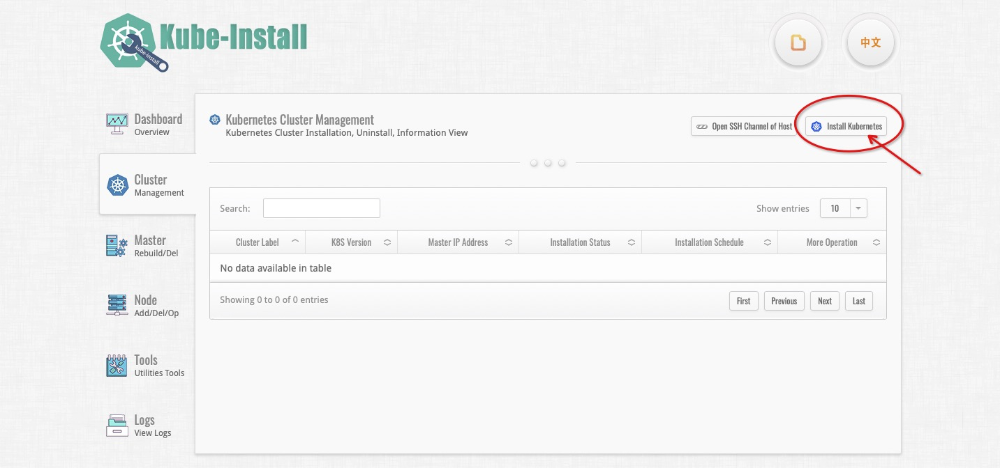
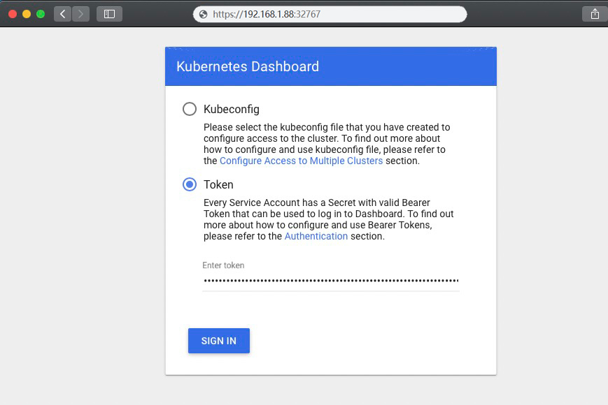

The highly available multiple kubernetes cluster can be installed offline with one click in binary mode, as well as schedule installation, addition of kubernetes node, deletion of kubernetes node, destruction of kubernetes master, rebuild of kubernetes master, and uninstallation of cluster.
<br>
(There is no need to install any software on the target host. You can deploy the highly available kubernetes cluster offline only by using an empty host!)
<br>


<br>

Switch Languages: <a href="README0.7.md">English Documents</a> | <a href="README0.7-zh-hk.md">繁体中文文档</a> | <a href="README0.7-zh.md">简体中文文档</a> | <a href="README0.7-jp.md">日本語の文書</a>

<br>

# [1] Compatibility

<br>
Compatibility matrix:

<table>
<tr><td><b>kube-install Version</b></td><td><b>Supported Kubernetes Version</b></td><td><b>Supported OS Version</b></td><td><b>Documentation</b></td></tr>
<tr><td> kube-install v0.8.* </td><td> kubernetes v1.24, v1.23, v1.22, v1.20, v1.19, v1.18 </td><td> CentOS 7 , RHEL 7 , CentOS 8 , RHEL 8 , SUSE Linux 15 , Ubuntu 20 </td><td><a href="README0.8.md">View details</a></td></tr>
<tr><td> kube-install v0.7.* </td><td> kubernetes v1.23, v1.22, v1.20, v1.19, v1.18, v1.17 </td><td> CentOS 7 , RHEL 7 , CentOS 8 , RHEL 8 , SUSE Linux 15 , Ubuntu 20 </td><td><a href="README0.7.md">View details</a></td></tr>
<tr><td> kube-install v0.6.* </td><td> kubernetes v1.22, v1.21, v1.20, v1.19, v1.18, v1.17, v1.16, v1.15, v1.14 </td><td> CentOS 7 , RHEL 7 , CentOS 8 , RHEL 8 , SUSE Linux 15 </td><td><a href="README0.6.md">View details</a></td></tr>
<tr><td> kube-install v0.5.* </td><td> kubernetes v1.21, v1.20, v1.19, v1.18, v1.17, v1.16, v1.15, v1.14 </td><td> CentOS 7 , RHEL 7 </td><td><a href="README0.5.md">View details</a></td></tr>
<tr><td> kube-install v0.4.* </td><td> kubernetes v1.21, v1.20, v1.19, v1.18, v1.17, v1.16, v1.15, v1.14 </td><td> CentOS 7 , RHEL 7 </td><td><a href="README0.4.md">View details</a></td></tr>
<tr><td> kube-install v0.3.* </td><td> kubernetes v1.18, v1.17, v1.16, v1.15, v1.14 </td><td>CentOS 7</td><td><a href="README0.3.md">View details</a></td></tr>
<tr><td> kube-install v0.2.* </td><td> kubernetes v1.14 </td><td> CentOS 7 </td><td><a href="README0.2.md">View details</a></td></tr>
<tr><td> kube-install v0.1.* </td><td> kubernetes v1.14 </td><td> CentOS 7 </td><td><a href="README0.1.md">View details</a></td></tr>
</table>


<br>
Notice: kube-install supports CentOS 7, CentOS 8, SUSE 15, RHEL 7 and RHEL 8 operating system environments. For a list of supported operating system distributions, please refer to <a href="docs/os-support.md">OS support list</a>.
<br>
<br>
<br>

# [2] Download kube-install package

<br>

You can download the `kube-install-*.tgz` package from https://github.com/cloudnativer/kube-install/releases. <br>

For example, we have downloaded the `kube-install-allinone-v0.8.0-beta.tgz` package.<br>

```
# cd /root/
# curl -O https://github.com/cloudnativer/kube-install/releases/download/v0.8.0-beta/kube-install-allinone-v0.8.0-beta.tgz
# tar -zxvf kube-install-allinone-v0.8.0-beta.tgz
# cd /root/kube-install/
```

Notice: If your network quality is poor and the download package is slow, you can use the download tool that supports breakpoint continuation to download.

<br>
<br>
<br>

# [3] Install kubernetes cluster by web platform

<br>

If you have four servers,kubernetes master software is installed on the three servers (192.168.1.11, 192.168.1.12, 192.168.1.13), and kubernetes node software is installed on the four servers (192.168.1.11, 192.168.1.12, 192.168.1.13, 192.168.1.14). The operating system of the server is pure CentOS Linux or RHEL(Red Hat Enterprise Linux). It's like this:
<table>
<tr><td><b>IP Address</b></td><td><b>Role</b></td><td><b>OS Version</b></td><td><b>Root Password</b></td></tr>
<tr><td>192.168.1.11</td><td>k8s-master,k8s-node,kube-install</td><td>CentOS Linux release 7 or Red Hat Enterprise Linux(RHEL) 7</td><td>cloudnativer</td></tr>
<tr><td>192.168.1.12</td><td>k8s-master,k8s-node</td><td>CentOS Linux release 7 or Red Hat Enterprise Linux(RHEL) 7</td><td>cloudnativer</td></tr>
<tr><td>192.168.1.13</td><td>k8s-master,k8s-node</td><td>CentOS Linux release 7 or Red Hat Enterprise Linux(RHEL) 7</td><td>cloudnativer</td></tr>
<tr><td>192.168.1.14</td><td>k8s-node</td><td>CentOS Linux release 7 or Red Hat Enterprise Linux(RHEL) 7</td><td>cloudnativer</td></tr>
</table>
You expect the architecture after installation to be as follows:


<br>
Notice: We use 192.168.1.11 as the kube-install host. In fact, you can use any host as kube-install host or any host outside the kubernetes cluster!
<br>

## 3.1 Initialize system environment

<br>
Please operate in the root user environment. Perform the system environment initialization operation on the kube-install host selected above: <br>

```
# cd /root/kube-install/
# ./kube-install -init -ostype "centos7"
```

Notice: Please make sure that the `-ostype` flag you entered is correct, only support `rhel7`, `rhel8`, `centos7`, `centos8`, `ubuntu20`, `suse15` these ty
pes of "ostype".<br>

<br>

## 3.2 Run kube-install web service

First run the web management service with the `systemctl start kube-install` command, and then open `http://your_kube-install_host_IP:9080` with a web browser.
<br>
Login with the user name `admin` and the default password `CloudNativeR`. You can change the password later through the web platform.

```
# systemctl start kube-install.service
#
# systemctl status kube-install.service
  ● kube-install.service - kube-install One click fast installation of highly available kubernetes cluster.
     Loaded: loaded (/etc/systemd/system/kube-install.service; disabled; vendor preset: disabled)
     Active: active (running) since Fri 2021-08-20 14:30:55 CST; 21min ago
       Docs: https://cloudnativer.github.io/
   Main PID: 2768 (kube-install)
     CGroup: /system.slice/kube-install.service
             └─2768 /go/src/kube-install/kube-install -daemon
   ...

```

Notice: Kube-install web service listens to `TCP 9080` by default. If you want to modify the listening address, you can set it by modifying the `kube-install -daemon -listen ip:port` parameter in the `/etc/systemd/system/kube-install.service` file, <a href="docs/systemd0.7.md">click here to view more details</a> ! <br>

## 3.3 Use the web platform to quick install 

Second, Click the `Install Kubernetes` button in the upper right corner to start the installation operation.



Notice: Before starting the installation, please open the SSH password free channel from localhost to the target host.You can use the `kube-install -exec sshcontrol` command to SSH through, or click the `Open SSH Channel of Host` button in the upper right corner to SSH through. Here is the process of SSH connection, <a href="docs/webssh0.7.md">click here to view more details</a> !<br>

<br>

Fill in relevant installation parameters in the pop-up form:<br>


explain:

* Please select the version of kubernetes you need to install. At present, 'Kube install' supports the installation and deployment of kubernetes v1.17 to 1.24. Other versions of kubernetes have not been verified yet.
* Please select the CNI plug-ins you need to install. At present, 'kube-install' supports CNI plug-ins such as flannel, calico, Kube router, weave and cilium. If you need to install "cilium", please upgrade the Linux kernel to version 4.9 or above.
* Please select your operating system environment. Since the lower versions of CentOS 7 and RedHat 7 may lack kernel modules, 'Kube install' provides the function of automatically upgrading the operating system kernels of CentOS 7 and rhel7 to 4.19. You can choose to use this function or manually optimize the operating system kernel yourself.

<br>

Notice: The default is to start the installation immediately. You can also set an installation time for scheduled installation.


For the installation process using the web platform, <a href="docs/webinstall0.7.md">click here to view more details</a> !
<br>
<br>
<br>

# [4]  Install kubernetes cluster by command line

<br>
You can also install the Kubernetes cluster by command line. 
<br>

## 4.1 Initialize system environment

<br>
Please operate in the root user environment. Perform the system environment initialization operation on the kube-install host selected above: <br>

```
# cd /root/kube-install/
# ./kube-install -init -ostype "centos7"
```

Notice: Please make sure that the `-ostype` flag you entered is correct, only support `rhel7`, `rhel8`, `centos7`, `centos8`, `ubuntu20`, `suse15` these types of "ostype".<br>

<br>

## 4.2 Open the SSH password free channel

<br>
Before installation, please open the SSH password free channel from localhost to the target host.

You can open the SSH password free channel by manually, or using the `kube-install -exec sshcontrol` command.<br>

```
# cd /root/kube-install/
# ./kube-install -exec sshcontrol -sship "192.168.1.11,192.168.1.12,192.168.1.13,192.168.1.14" -sshpass "cloudnativer"
```

Or click the `Open SSH Channel of Host` button in the web platform to SSH through. Here is the process of SSH connection, <a href="docs/webssh0.7.md">click here to view more details</a> !<br>

<br>

## 4.3 One click Install kubernetes cluster

<br>
Please operate in the root user environment. Execute on the kube-install host selected above:<br>

```
# cd /root/kube-install/
# ./kube-install -exec install -master "192.168.1.11,192.168.1.12,192.168.1.13" -node "192.168.1.11,192.168.1.12,192.168.1.13,192.168.1.14" -k8sver "1.22" -ostype "centos7" -label "192168001011"
```

Notice: 
* Please make sure that the `-ostype` flag you entered is correct, only support `rhel7`, `rhel8`, `centos7`, `centos8`, `ubuntu20`, `suse15` these types of "ostype". Since the lower versions of CentOS 7 and RedHat 7 may lack kernel modules, 'Kube install' provides the function of automatically upgrading the operating system kernels of CentOS 7 and rhel7 to 4.19. You can choose to use this function by `-upgradekernel` or manually optimize the operating system kernel yourself.
* Please select the CNI plug-ins you need to install. At present, 'kube-install' supports CNI plug-ins such as `Flannel`, `Calico`, `Kube-router`, `weave` and `Cilium`. If you need to install "cilium", please upgrade the Linux kernel to version 4.9 or above.

<br>

In addition, if you need to specify the directory path to the Kubernetes cluster installation, you can set it using the `-softdir` parameter.

<br>


## 4.4 Login kubernetes dashboard UI

<br>
Execute the following command on the kube-install you selected to view the kube-dashboard console URL and key:<br>

```
# cat /opt/kube-install/loginkey.txt
```


Login to the kube-dashboard console UI using the URL and key in the `/opt/kube-install/loginkey.txt` document.Here are the relevant screenshots:




<br>

<br>

# [5] Add Node, Delete Node, Rebuild Master, and Uninstall

<br>

Kube-install can not only quickly install the highly available kubernetes cluster, but also add k8s-node, delete k8s-node, delete k8s-master and rebuild k8s-master.<br>

Suppose you expect to install two servers (192.168.1.15 and 192.168.1.16) as k8s-nodes and join the kubernetets cluster in Chapter [2].

<table>
<tr><td><b>IP Address</b></td><td><b>Role</b></td><td><b>OS Version</b></td><td><b>Root Password</b></td></tr>
<tr><td>192.168.1.11</td><td>k8s-master,k8s-node,kube-install</td><td>CentOS Linux release 7 or Red Hat Enterprise Linux(RHEL) 7</td><td>cloudnativer</td></tr>
<tr><td>192.168.1.12</td><td>k8s-master,k8s-node</td><td>CentOS Linux release 7 or Red Hat Enterprise Linux(RHEL) 7</td><td>cloudnativer</td></tr>
<tr><td>192.168.1.13</td><td>k8s-master,k8s-node</td><td>CentOS Linux release 7 or Red Hat Enterprise Linux(RHEL) 7</td><td>cloudnativer</td></tr>
<tr><td>192.168.1.14</td><td>k8s-node</td><td>CentOS Linux release 7 or Red Hat Enterprise Linux(RHEL) 7</td><td>cloudnativer</td></tr>
<tr><td><b>192.168.1.15</b></td><td>k8s-node</td><td>CentOS Linux release 7 or Red Hat Enterprise Linux(RHEL) 7</td><td>cloudnativer</td></tr>
<tr><td><b>192.168.1.16</b></td><td>k8s-node</td><td>CentOS Linux release 7 or Red Hat Enterprise Linux(RHEL) 7</td><td>cloudnativer</td></tr>
</table>

Execute the following command on kube-install host:<br>

```
# kube-install -exec addnode -node "192.168.1.15,192.168.1.16" -k8sver "1.22" -ostype "centos7" -label "192168001011"
```

Notice: Please make sure that the `-ostype` flag you entered is correct, only support `rhel7`, `rhel8`, `centos7`, `centos8`, `ubuntu20`, `suse15` these types of "ostype".<br>
In addition, if you need to specify the directory path to add Kubernetes node, you can set it using the `-softdir` parameter.

<br>

The architecture after installation is shown in the following figure:


You can also add Kubernetes node using the kube-install web platform. For the installation process using the web platform, click "Add Node" to fill in the form to complete the expansion of Kubernetes node. <a href="docs/webinstall0.7.md">click here to view more details</a> ! <br>


You can click "Enable Terminal" and "Web Terminal" to use the Web terminal to manage the Kubernetes node server.<br>

Notice: you can <a href="docs/operation0.7.md">click here to view more operation documents</a> about add k8s-node, delete k8s-node, delete k8s-master, rebuild k8s-master, and uninstall cluster.

<br>
<br>


# [6] Command line help documentation

<br>

You can execute `kube-install -help` command to view the command line help document of kube-install, or <a href="docs/parameters0.7.md">click here to view more command line help documents</a>.<br>

<br>
<br>


# [7] How to build it

<br>

The build can be completed automatically by executing the `make` command. You can also <a href="docs/build.md">see more detailed build instructions here</a>.<br>

<br>
<br>


# [8] How to Contribute

If you have problems in use, <a href="https://github.com/cloudnativer/kube-install/issues">you can click here submit issues to us</a>, or fork it and submit PR.
<br>

```
# git clone your-fork-code
# git checkout -b your-new-branch
# git commit -am "Fix bug or add some feature"
# git push origin your-new-branch
```
<br>
Welcome to submit issues or PR to us.
<br>
Thank you to every contributor!

<br>
<br>
<br>

