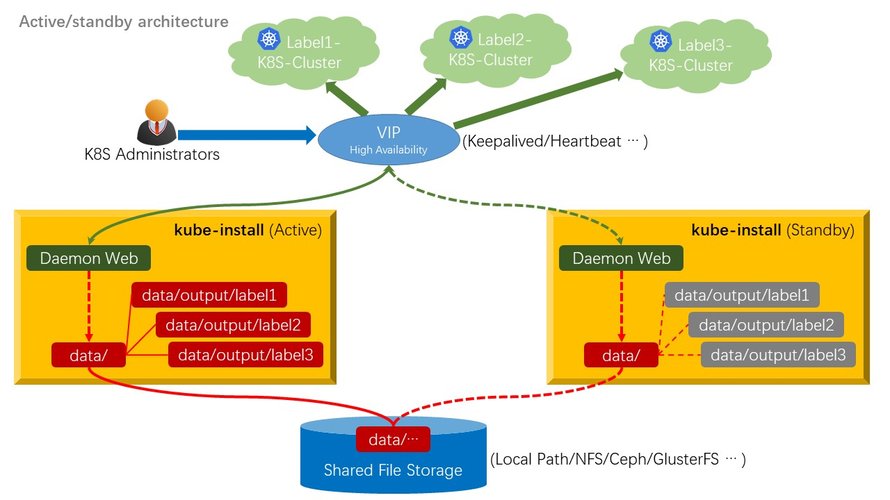

バイナリ方式では、オフラインで利用可能な複数kubernetes クラスタをインストールし、タイミングインストール、kubernetes ノードの追加、kubernetes ノードの削除、kubernetes ホストの廃棄、kubernetes ホストの再構築、kubernetes クラスタのアンマウントなどをサポートします。
<br>
（目的のホストにソフトウェアをインストールする必要はなく、純粋な裸マシンがあればオフラインで高利用可能な kubernetes  クラスタの配置を完了することができます。）
<br>


<br>

<a href="README0.8.md">English Documents</a> | <a href="README0.8-zh-hk.md">繁体中文文档</a> | <a href="README0.8-zh.md">简体中文文档</a> | <a href="README0.8-jp.md">日本語の文書</a>

<br>

# [1] 互換性

<br>
互換性説明:

<table>
<tr><td><b>kube-installバージョン</b></td><td><b>Kubernetesバージョン</b></td><td><b>オペレーティングシステム</b></td><td><b>関連文書</b></td></tr>
<tr><td> kube-install v0.9.* </td><td> kubernetes v1.28, v1.27, v1.26, v1.25, v1.24 </td><td> CentOS 7 , RHEL 7, CentOS 8 , RHEL 8 , SUSE Linux 15 , Ubuntu 20 </td><td><a href="README0.9-jp.md">説明ドキュメント</a><br><a href="docs/component0.9.md">構成部品構成表</a></td></tr>
<tr><td> kube-install v0.8.* </td><td> kubernetes v1.24, v1.23, v1.22, v1.20, v1.19, v1.18 </td><td> CentOS 7 , RHEL 7 , CentOS 8 , RHEL 8 , SUSE Linux 15 , Ubuntu 20 </td><td><a href="README0.8-jp.md">詳細の表示</a></td></tr>
<tr><td> kube-install v0.7.* </td><td> kubernetes v1.23, v1.22, v1.20, v1.19, v1.18, v1.17 </td><td> CentOS 7 , RHEL 7 , CentOS 8 , RHEL 8 , SUSE Linux 15 , Ubuntu 20 </td><td><a href="README0.7-jp.md">詳細の表示</a></td></tr>
<tr><td> kube-install v0.6.* </td><td> kubernetes v1.22, v1.21, v1.20, v1.19, v1.18, v1.17, v1.16, v1.15, v1.14 </td><td> CentOS 7 , RHEL 7 , CentOS 8 , RHEL 8 , SUSE Linux 15 </td><td><a href="README0.6.md">詳細の表示</a></td></tr>
<tr><td> kube-install v0.5.* </td><td> kubernetes v1.21, v1.20, v1.19, v1.18, v1.17, v1.16, v1.15, v1.14 </td><td> CentOS 7 , RHEL 7 </td><td><a href="README0.5.md">詳細の表示</a></td></tr>
<tr><td> kube-install v0.4.* </td><td> kubernetes v1.21, v1.20, v1.19, v1.18, v1.17, v1.16, v1.15, v1.14 </td><td> CentOS 7 , RHEL 7 </td><td><a href="README0.4.md">詳細の表示</a></td></tr>
<tr><td> kube-install v0.3.* </td><td> kubernetes v1.18, v1.17, v1.16, v1.15, v1.14 </td><td>CentOS 7</td><td><a href="README0.3.md">詳細の表示</a></td></tr>
<tr><td> kube-install v0.2.* </td><td> kubernetes v1.14 </td><td> CentOS 7 </td><td><a href="README0.2.md">詳細の表示</a></td></tr>
<tr><td> kube-install v0.1.* </td><td> kubernetes v1.14 </td><td> CentOS 7 </td><td><a href="README0.1.md">詳細の表示</a></td></tr>
</table>


<br>
注意：kube-installはCentOS 7、CentOS 8、SUSE 15、RHEL 7、RHEL 8のオペレーティングシステム環境に対応しています。<a href="docs/os-support.md">ここをクリックして、kube-installがサポートするオペレーティングシステムの発行版のリストを調べます<a>。
<br>
<br>
<br>

# [2] kube-installパッケージを載せます。

<br>


あなたは https://github.com/cloudnativer/kube-install/releases ここで `kube-install-*.tgz` ソフトパッケージをダウンロードします。 <br>
例えば `kube-install-allinone-v0.8.0.tgz`パッケージをダウンロードしてインストールします：<br>

```
# cd /root/
# curl -O https://github.com/cloudnativer/kube-install/releases/download/v0.8.0/kube-install-allinone-v0.8.0.tgz
# tar -zxvf kube-install-allinone-v0.8.0.tgz
# cd /root/kube-install/
```

注意：もしあなたのローカルのネットワーク環境があまり良くないなら、断続的な継続をサポートするダウンロードソフトを使ってパッケージをダウンロードすることをお勧めします。より良いダウンロード体験を得ることができます。

<br>
<br>

# [3] Webプラットフォームでkubernetesクラスタをインストールする

<br>
  
4台のサーバーがある場合、K8s-masterは3台のサーバー（192.168.1.11、192.168.1.12、192.168.1.13）にインストールされ、K8s-nodeは4台のサーバ（192.168.1.11、192.168.1.12、192.168.1.13、192.168.1.14）にインストールされます。サーバのオペレーティングシステムは、純粋なCentOS LinuxまたはRHEL（RedHat Enterprise Linux）であり、具体的には以下の表に示す。
<table>
<tr><td><b>IPアドレス</b></td><td><b>インストールが必要なコンポーネント</b></td><td><b>OSバージョン</b></td><td><b>rootパスワード</b></td></tr>
<tr><td>192.168.1.11</td><td>k8s-master,k8s-node,kube-install</td><td>CentOS Linux release 7 or Red Hat Enterprise Linux(RHEL) 7</td><td>cloudnativer</td></tr>
<tr><td>192.168.1.12</td><td>k8s-master,k8s-node</td><td>CentOS Linux release 7 or Red Hat Enterprise Linux(RHEL) 7</td><td>cloudnativer</td></tr>
<tr><td>192.168.1.13</td><td>k8s-master,k8s-node</td><td>CentOS Linux release 7 or Red Hat Enterprise Linux(RHEL) 7</td><td>cloudnativer</td></tr>
<tr><td>192.168.1.14</td><td>k8s-node</td><td>CentOS Linux release 7 or Red Hat Enterprise Linux(RHEL) 7</td><td>cloudnativer</td></tr>
</table>
設置後の配置構造は下図のようになります。


<br>
注意：ここでは192.168.1.11をkube-installソースインストール機として使用します。実際には、任意のホスト（kubernetes クラスタ以外のホストを含む）をkube-installソースインストール機として使用することができます。
<br>
  
## 3.1 システム環境を初期化

<br>
まず、rootユーザーを使って、kube-installソースインストール機のローカル環境を初期化操作し、解凍後のソフトウェアディレクトリに入って `kube-install -init` コ>
マンドを実行する必要があります：<br>

```
# cd /root/kube-install/
# ./kube-install -init -ostype "centos7"
```

注意：kube-installソフトウェアは`rhel7`，`rhel8`，`centos7`，`centos8`，`ubuntu20`，`suse15`などのバージョンのオペレーティングシステムをサポートします。初期
化操作をする時、`-ostype`パラメータの設定が正しいことを確認してください。
<br>

## 3.2 kube-installのWeb管理サービスを実行します

その後、Webインターフェースの右上の`Install Kubernetes`ボタンをクリックして、Kubernetesクラスタのインストールを開始します。kube-installのWeb管理プラットフォームはSSHオン、タイミングインストール配置、Node拡張、Master修復、クラスタアンインストールなどの強力な機能を備えており、Web管理プラットフォームでより良いインストール体験を得ることができます。

```
# cd /root/kube-install/
# ./kube-install -init -ostype "centos7"
#
# systemctl start kube-install.service
#
# systemctl status kube-install.service
  ● kube-install.service - kube-install One click fast installation of highly available kubernetes cluster.
     Loaded: loaded (/etc/systemd/system/kube-install.service; disabled; vendor preset: disabled)
     Active: active (running) since Fri 2021-08-20 14:30:55 CST; 21min ago
       Docs: https://cloudnativer.github.io/
   Main PID: 2768 (kube-install)
     CGroup: /system.slice/kube-install.service
             └─2768 /go/src/kube-install/kube-install -daemon
   ...

```

この時点で、Webブラウザを使って開くことができます `http://kube-installソースインストール機のIP:9080` は、kube-installのWeb管理プラットフォームにアクセスしました。 ユーザー名 `admin` とデフォルトパスワード `CloudNativeR` でログイン! (後でwebプラットフォームでパスワードを変更できます)
<br>

注意：kube-installのWeb管理プラットフォームサービスはデフォルトで `TCP 9080`を傍受します。この傍受アドレスを修正したいなら `/etc/systemd/system/kube-install.service` ファイルの `kube-install -daemon -listen ip:port` パラメータを修正して設定することができます。<a href="docs/systemd0.7.md">ここをクリックして詳細文書を見ることができます</a>。<br>

## 3.3 Web画面にKubernetesをインストールする

その後、Webインターフェースの右上の`Install Kubernetes`ボタンをクリックしてkubernetesクラスタのインストールを開始します。


注意：ターゲットホストにkubernetesクラスタをインストールする前に、ターゲットホストのSSH免密チャンネルにkube-installソースインストールマシンをローカルにオンしてください。
あなたは自分で手で目標ホストのSSHチャンネルを打てばいいです。右上の `Open SSH Channel of Host` ボタンをクリックして打開してもいいです。<a href="docs/webssh0.8.md">ここをクリックしてもっと詳しい文書を確認できます</a>。
<br>

ポップアップの「インストールフォーム」ウィンドウに、インストールに必要なパラメータ情報を入力します。


説明:

* インストールするKubernetesバージョンを選択してください。現在kube-installはv 1をサポートしています。17~1.24バージョンのKubernetesインストール導入、その他のバージョンのKuberneteは検証されていません。
* インストールするCNIプラグインを選択してください。現在kube-installは`Flannel`、`Calico`、`Kube-router`、`Weave`、`Cilium`などのCNIプラグインタイプをサポートしています。`Cilium`をインストールする必要がある場合は、Linuxカーネルを4.9以降にアップグレードします。
* オペレーティングシステム環境を選択してください。低バージョンの`Centos 7`と`RHEL 7`にはカーネルモジュールが欠けている可能性があります。kube-installは`Centos 7`と`RHEL 7`オペレーティングシステムカーネルに4.19に自動的にアップグレードする機能を提供しています。この機能を使用するか、オペレーティングシステムカーネルを手動で最適化するかを選択できます。

<br>

注意: タイミングインストールを設定しない場合は、デフォルトではすぐにインストールを開始します。タイミングインストールをしたい場合は、以下のタイミングインストールの日付と時間を選択することもできます。


<a href="docs/webinstall0.7.md">ここをクリックして、より多くのkube-installのWeb管理プラットフォームを通じて配置の詳細を見ることができます</a>。
<br>
<br>
<br>


# [4] 速やかにKubernetesクラスタをインストールする

<br>
Webプラットフォームを使用してkubernetesクラスタをインストールできるほか、kube-installのコマンドラインでkubernetesクラスタをインストールすることもできます。kube-installのコマンドラインは使いやすいです。
<br>

## 4.1 システム環境を初期化

<br>
まず、rootユーザーを使って、kube-installソースインストール機のローカル環境を初期化操作し、解凍後のソフトウェアディレクトリに入って `kube-install -init` コマンドを実行する必要があります：<br>

```
# cd /root/kube-install/
# ./kube-install -init -ostype "centos7"
```

注意：kube-installソフトウェアは`rhel7`，`rhel8`，`centos7`，`centos8`，`ubuntu20`，`suse15`などのバージョンのオペレーティングシステムをサポートします。初期化操作をする時、`-ostype`パラメータの設定が正しいことを確認してください。
<br>

## 4.2 ターゲットホストへのSSHチャネル

<br>
ターゲットホストにkubernetesクラスタをインストールする前に、クビ-innstallソースのインストール機を通じて、ターゲットホストのSSH非密チャンネルにローカルに接続してください。
あなたは自分で手で目標ホストのSSH通路に通すことができます。また `kube-install -exec sshcontrol` コマンドで通してもいいです。<br>

```
# cd /root/kube-install/
# ./kube-install -exec sshcontrol -sship "192.168.1.11,192.168.1.12,192.168.1.13,192.168.1.14" -sshpass "cloudnativer"
```

あなたもkube-installのWeb管理プラットフォームを通じてターゲットホストのSSHチャネルにアクセスできます。<a href="docs/webssh0.8.md">ここをクリックして、Web管理プラットフォームを使ってSSHチャネルを打開する方法を確認してください</a>。<br>

<br>

## 4.3 ワンタッチで配置kubernetesクラスタをインストールします。

<br>
kube-installソースインストーラでrootユーザーを使用して次のコマンドを実行します。

```
# cd /root/kube-install/
# ./kube-install -exec install -master "192.168.1.11,192.168.1.12,192.168.1.13" -node "192.168.1.11,192.168.1.12,192.168.1.13,192.168.1.14" -k8sver "1.22" -ostype "centos7" -label "192168001011"
```

注意：

* kube-installソフトウェアは`rhel 7`，`rhel 8`，`centos7`，`centos8`，`ubuntu20`，`suse15`などのバージョンのオペレーティングシステムをサポートしています。セットアップ操作をする時、`-ostype`パラメータの設定が正しいことを確認してください。低いバージョンの`centos 7`と`redhat 7`はカーネルモジュールが不足する可能性があるので、`kube-install`は`centos 7`と`rhel 7`オペレーティングシステムのカーネルに対して自動的に4.19にアップグレードする機能を提供しています。この機能を使って、`-upgradekernel`パラメータを選択することができます。
* あなたがインストールしたいCNIプラグインを選択してください。現在は、`kube-innstall`が`Flannel`、`Calico`、`Kube-router`、`Weave`、`Cilium`などのCNIプラグインタイプをサポートしています。`Clium`をインストールする必要があれば、Linuxカーネルを4.9以上にアップグレードしてください。

<br>

また、Kubernetesクラスタを目的ホストにインストールするディレクトリパスをカスタマイズする必要があれば `-softdir` パラメータを持って設定することができます。

<br>


## 4.4 Kubernetes dashboard画面に登録する

<br>
loginkey.txtファイルを確認することで、kube-dashboardの登録住所と鍵を取得することができます。<br>

```
# cat /opt/kube-install/loginkey.txt
```


以下のスクリーンショットに示すように、kube-dashboardの登録アドレスと鍵：


<br>

<br>

# [5] 拡張容量と廃棄Node|修復Master|アンインストールクラスタ

<br>

Kube-installは、単一のマシンと高利用可能なkubernetesクラスタを簡単にインストールするだけでなく、k8s-nodeの拡張と廃棄、k8s-masterの廃棄と修復、kubernetesクラスタのアンインストールなどをサポートします。<br>
例えば、今は第[2]チャプターにインストールされたクベルkubernetesクラスタに、k8s-nodeノードを2つ追加する必要があります（192.168.1.15 and 192.168.1.16）、関連情報は以下の通りです。

<table>
<tr><td><b>IPアドレス</b></td><td><b>インストールが必要なコンポーネント</b></td><td><b>OSバージョン</b></td><td><b>rootパスワード</b></td></tr>
<tr><td>192.168.1.11</td><td>k8s-master,k8s-node,kube-install</td><td>CentOS Linux release 7 or Red Hat Enterprise Linux(RHEL) 7</td><td>cloudnativer</td></tr>
<tr><td>192.168.1.12</td><td>k8s-master,k8s-node</td><td>CentOS Linux release 7 or Red Hat Enterprise Linux(RHEL) 7</td><td>cloudnativer</td></tr>
<tr><td>192.168.1.13</td><td>k8s-master,k8s-node</td><td>CentOS Linux release 7 or Red Hat Enterprise Linux(RHEL) 7</td><td>cloudnativer</td></tr>
<tr><td>192.168.1.14</td><td>k8s-node</td><td>CentOS Linux release 7 or Red Hat Enterprise Linux(RHEL) 7</td><td>cloudnativer</td></tr>
<tr><td><b>192.168.1.15</b></td><td>k8s-node</td><td>CentOS Linux release 7 or Red Hat Enterprise Linux(RHEL) 7</td><td>cloudnativer</td></tr>
<tr><td><b>192.168.1.16</b></td><td>k8s-node</td><td>CentOS Linux release 7 or Red Hat Enterprise Linux(RHEL) 7</td><td>cloudnativer</td></tr>
</table>

Kube-installソースホストにrootユーザを使用して以下のコマンドを実行します：<br>

```
# kube-install -exec addnode -node "192.168.1.15,192.168.1.16" -k8sver "1.22" -ostype "centos7" -label "192168001011"
```

注意：kube-installソフトウェアは`rhel7`，`rhel8`，`centos7`，`centos8`，`ubuntu20`，`suse15`などのバージョンのオペレーティングシステムをサポートします。初期化操作をする時、`-ostype`パラメータの設定が正しいことを確認してください。<br>
また、Kubernetesクラスタを目的ホストにインストールするディレクトリパスをカスタマイズする必要があれば `-softdir` パラメータを持って設定することができます。

<br>

設置完了後の配置構造は下図のようになります。


`kube-install -exec addnode`コマンドを使用してk8s-nodeノードの拡張を行うほか、あなたも同様にkube-installのWeb管理プラットフォームを使用してk8s-nodeノードの拡張を行うことができます。`Add Node`ボタンをクリックしてフォームを記入すれば、k8s-nodeの拡張が完了します。<a href="docs/webinstall0.7.md">ここをクリックしてkube-installのWeb管理プラットフォームを使ってk8s-nodeノードを拡張する方法を確認できます</a>。


ウェブ端末でk8s-nodeサーバを管理するには、`Enable Terminal`と`Web Terminal`をクリックしてください。<br>

注意：<a href="docs/operation0.7.md">ここをクリックして、もっと多くのk8s-nodeとk8s-masterを破壊し、k8s-masterを修復し、クラスタをアンロードする操作につ>
いて確認してください</a>。

<br>
<br>

# [6] kube-install命令行の助け

<br>
  
あなたは`kube-install -help`コマンドを実行して、kube-installの使用支援文書を確認してもいいです。<a href="docs/parameters0.8.md">ここをクリックして、より詳細なコマンドラインヘルプドキュメントを確認してもいいです</a>。

<br>
<br>

# [7] kube-installクラスタアーキテクチャ

<br>

`./data/`ディレクトリは、`kube-install`インストールデプロイのすべてのステータス情報を格納するために使用され、すべてのkubernetesクラスタの構成などの情報が含まれます。`./data/`ディレクトリはファイルストレージの形式で共有され、一部の負荷等化ソフトウェアによってプライマリ・スタンバイ・スイッチングまたは負荷等化クラスタ効果を実現する。<a href="docs/architecture0.8.md">ここをクリックして、より詳細なアーキテクチャドキュメント</a>を表示できます。

  
  
<br>
<br>


# [8] IssuesとPRを提出してください

使用中に問題があったら、<a href="https://github.com/cloudnativer/kube-install/issues">https://github.com/cloudnativer/kube-install/issues</a>Issuesを提出してもいいです。Forkソースコードを修正してBUGを修復してみて、PRを提出してください。
  
<br>

```
# git clone your-fork-code
# git checkout -b your-new-branch
# git commit -am "Fix bug or add some feature"
# git push origin your-new-branch
```
<br>
IssuesとPRを提出してください。
<br>
貢献者の皆様、ありがとうございます。

<br>
<br>
<br>
